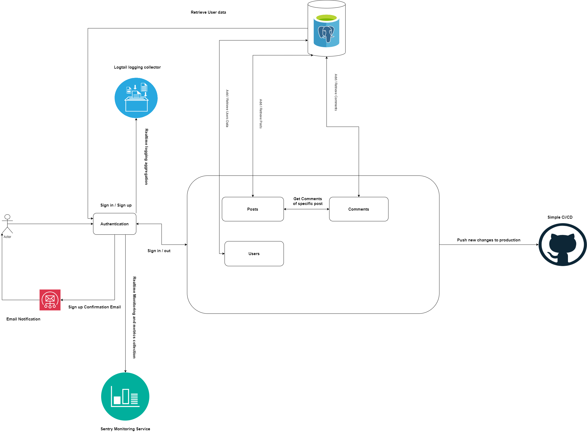
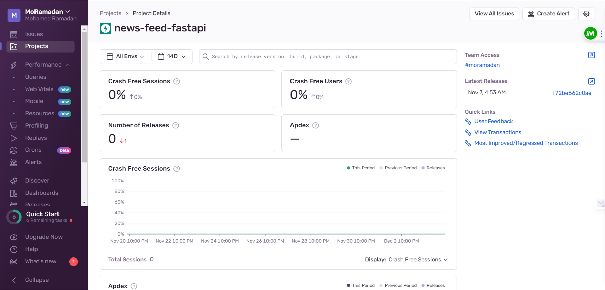
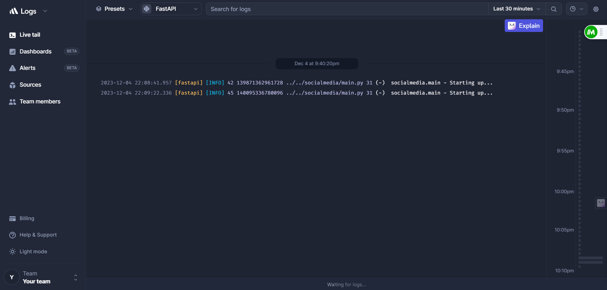

# Post Feature For Feed Feature (Social Media) 🥇


Simple implementation of a social media post feature.Users can sign up and activate their account via confirmation email. They can then create posts, comment on them and like them. 


## High-Level Design





## Build Status

 


## Monitoring with Sentry





## Logging with Logtail





## How to Run Offline


Follow these steps to run the project offline:


1. Clone the repository:

 ```bash

   git clone https://github.com/mohamedramadan14/news-feed-posts-feature.git

```


2. Create Virtual Environment :

```bash

   python -m venv venv

   source venv/Scripts/activate [Windows] 

   # OR 

   source venv/bin/activate     [Linux/Mac]

```

3. Install Dependencies :

```bash

   pip install -r requirements.txt

```

4. Run the project :

```bash

   cd socialmedia

   uvicorn main:app --reload

```
